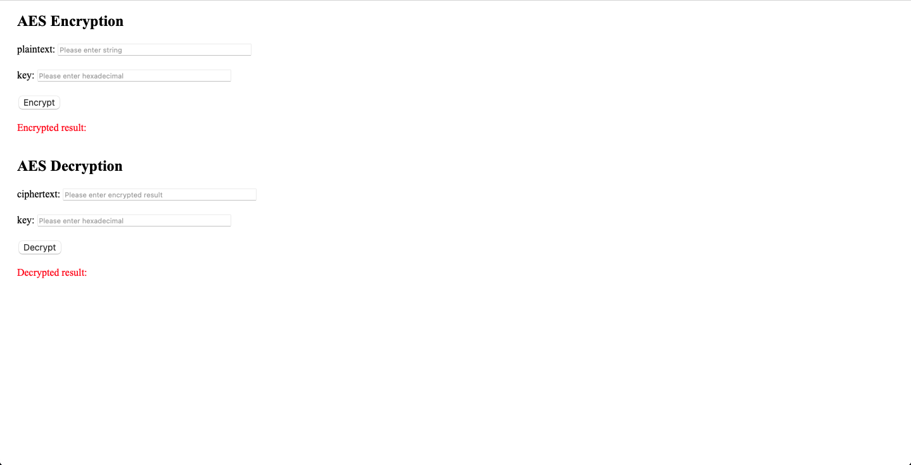
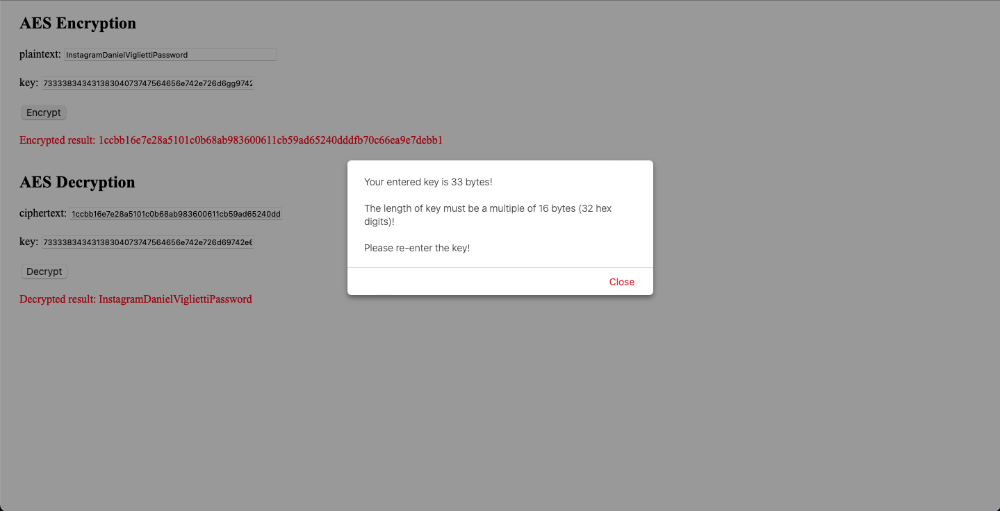

# INTE2401-AES256

Cloud Security, Assignment 2, Question 1

Author: Daniel Viglietti s3844180

Date: 15/04/2022

JavaScript Web Interface for Cloud AES256 Encryption

Dependencies: https://www.npmjs.com/package/aes-js

## Encryption

To encrypt a message, enter the plaintext so that it equates to a multiple of 16 bytes (example: "TextMustBe16Byte") and then enter a **hexadecimal** string for the key that is a multiple of 16 bytes (example, a 256-bit key will be 64 hexadecimal characters).

Press the encrypt button and it will spit out the ciphertext encryption.

## Decryption

To decrypt a message, enter a ciphertext string that equates to a multiple of 16 bytes (or 32 hex digits), and then enter a **hexadecimal** string for the key that is a multiple of 16 bytes (example, a 256-bit key will be 64 hexadecimal characters).

Press the decrypt button and it will spit out the plaintext.

## Errors

If a key or plaintext with an incorrect length is entered, a warning will pop up and you will have to correct the errors before proceeding.

